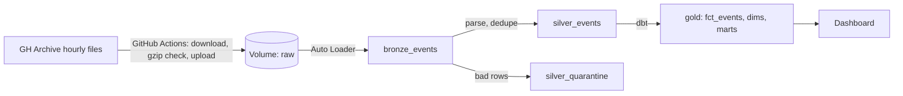

# Github Archive Lakehouse

Incremental data pipeline on Databricks: hourly GitHub event files in, tested dbt models out.
Demonstrates data ingestion and transformation via Databricks and dot.

## Architecture

## Stack
Databricks Free Edition (serverless), Delta, Unity Catalog, Auto Loader, dbt-databricks, GitHub Actions.

## Layers
| Layer | What it holds |
|---|---|
| Bronze | Raw event JSON as text plus source-file metadata |
| Silver | Parsed, typed, deduplicated events; bad rows quarantined |
| Gold | Star schema (fct_events, dim_actor, dim_repo) plus aggregates (fct_repo_daily, mart_daily_activity) |

## Results
TODO: your measured numbers: rows, GB, files, ingest time per day, dbt build time, clustering before/after.

## Data quality and failure handling
TODO (own words): gzip check before upload, quarantine, dedupe, missing-hours view, dbt tests (including the silver-vs-gold row-count test), freshness check, retries in the fetch scripts.

## Incidents
TODO: one short paragraph each: the duplicate file, the corrupt file, the silent-skip backfill.

## What breaks at 10x
TODO: your list.

## Limitations
- Free Edition blocks outbound internet, so a GitHub Actions job downloads files and pushes them into Databricks.
- Streaming (Kafka) is not part of this project for that reason.
- TODO: data window and known gaps.

## Links
- dbt docs and lineage: TODO your GitHub Pages URL
- Decisions log: [DECISIONS.md](DECISIONS.md)
- Walkthrough video: TODO

## How I built it
I designed the architecture and made the decisions, and used AI assistance for boilerplate and debugging.
