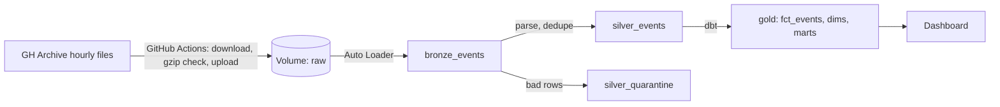
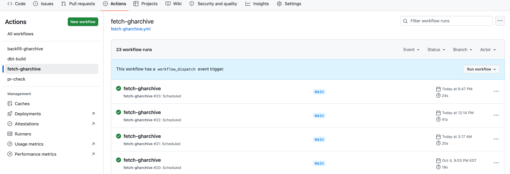
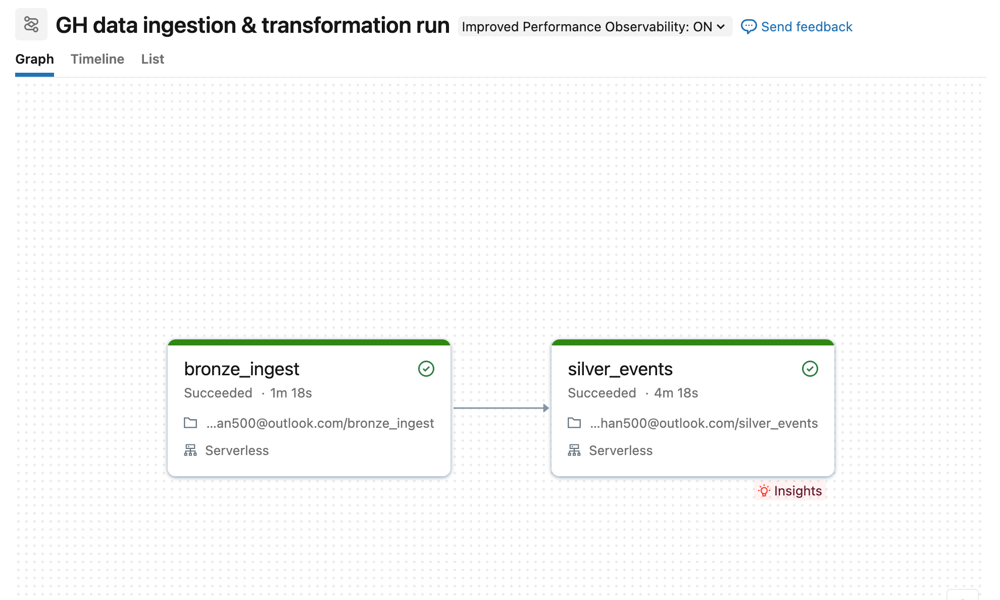
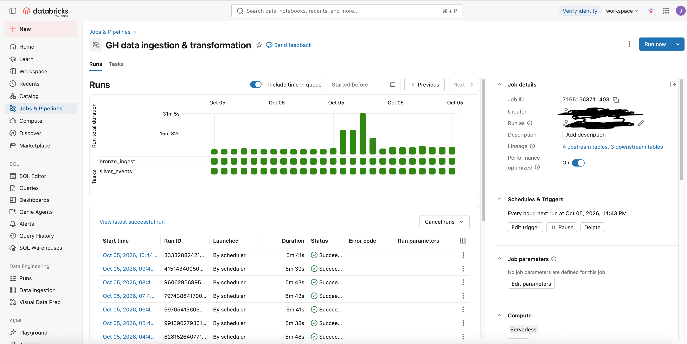
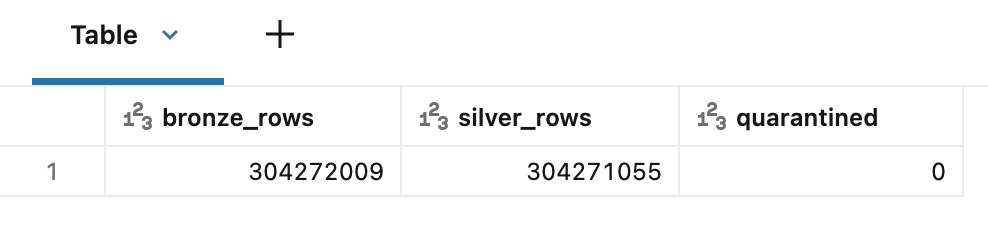
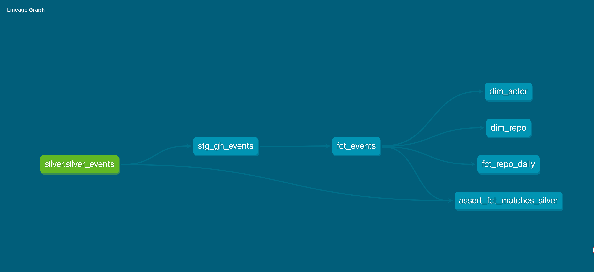
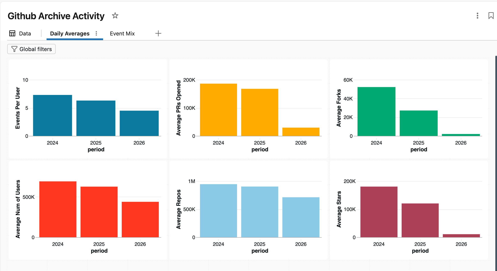
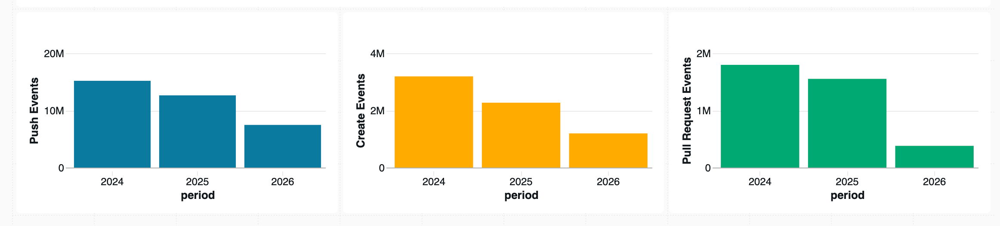

# GH Archive Lakehouse

Incremental data pipeline on Databricks Free Edition. It ingests hourly GitHub event files, deduplicates events, quarantines bad rows, and serves tested dbt models. I built it to show ingestion, data quality, modeling, and automation end to end.  

GH Archive is a project to record the public GitHub timeline, archive it, and make it easily accessible for further analysis. Open-source developers all over the world are working on millions of projects: writing code & documentation, fixing & submitting bugs, and so forth.

https://www.gharchive.org/

https://jphan500.github.io/gh-archive-lakehouse/#!/overview

## Architecture

## Tour
1. **Ingestion:** a scheduled GitHub Actions run uploading hourly files 

2. **Pipeline:** the Databricks job running bronze then silver

3. **Data quality:** quarantined rows from the bad-rows drill 

4. **Modeling:** the dbt lineage graph 

5. **Output:** the dashboard  

## Stack
Databricks Free Edition (serverless), Delta, Unity Catalog, Auto Loader, dbt-databricks, GitHub Actions.

## Layers
| Layer | What it holds |
|---|---|
| Bronze | Raw event JSON as text plus source-file metadata |
| Silver | Parsed, typed, deduplicated events; bad rows quarantined |
| Gold | Star schema (fct_events, dim_actor, dim_repo) plus aggregates (fct_repo_daily, mart_daily_activity) |

## Results (as of 10/05/2026)
- Data: 1,671 hourly files, 303764587 events, 69 complete days between 2024-01-01 and 2026-10-04
- Volume: about 4M events and 1.8 GB of raw files per day; bronze ingest takes about a minute per day
- Reliability: 0 missing hours across loaded days; 0 hours were not yet published upstream when I checked
- Duplicates: 954 duplicate events dropped in silver; 0 rows quarantined
- dbt: models and tests build in about 2 minutes; fct_events is incremental
- Analysis: Activity from the period of Sep 28 - Oct 4 between 2024 and 2026 has steadily decreased. Average number of pull requests opened went down from 18,6249 in 2024, to 16,7806 in 2025 to 29,555 in 2026. Events per user decreased from 7.3 in 2024, to 6.3 to 2025 to 4.5 in 2026. The biggest decrease in user activity seems to be from 2025 to 2026.

## Data quality and failure handling  
- Every download is checked with gzip -t before upload, so corrupt files never reach the volume.
- Silver parses with try_ functions, deduplicates on event_id, and quarantines unparseable or incomplete rows with a reason.
- A missing-hours view checks each loaded day for all 24 hours.
- dbt tests cover keys and relationships, plus a custom test that gold row counts match silver.
- A freshness check fails if the hourly job stops.
- Fetch scripts retry transient errors and tell "not published yet" (404) from real failures.

## Incidents  
**Duplicate file.** A test file with the same content as an existing hour was ingested as new, because Auto Loader tracks files by path, not content. Silver deduplicates on event_id, so the duplicate rows were dropped.

**Corrupt file.** A truncated gzip failed the read with an end-of-stream error. I added a gzip check to every fetch script so corrupt downloads never reach the volume.

**Silent skips.** A backfill left gaps because connection resets were treated as missing files. The missing-hours view caught it. I added retries, separated 404s from failures, handled errors per file, and widened the hourly look-back to 24 hours.

## What happens if data grows 10x? 
- dbt dimension and mart tables rebuild fully, and tests scan full tables. Incremental models by date can help reduce pressure on dbt runs.
- One small SQL warehouse and a daily serverless quota would need paid compute if there were further growth.
- Backfills upload one file at a time from a single runner. I would parallelize the work by day across jobs to increase efficiency.
- Bronze stores raw JSON as text, which costs storage. I would add a retention policy and archive older files.
- Reduced latency could be achieved via streaming instead of batch

## Limitations
- Free Edition restricts outbound internet, so a GitHub Actions job downloads files and pushes them into Databricks.
- This is a sample, not the full archive: Jan / Feb 2024, plus Sep 28 to Oct 4 in 2024, 2025, and 2026, plus a live window. The full archive would be about 1.7 TB.
- Free Edition has daily compute quotas and no SLA, and inactive accounts can be deleted.
- Kafka is not part of this project.

## Links
- dbt docs and lineage: TODO your GitHub Pages URL
- Decisions log: [DECISIONS.md](DECISIONS.md)

## How I built it
I designed the architecture and made the decisions, and used AI assistance for boilerplate and debugging.
